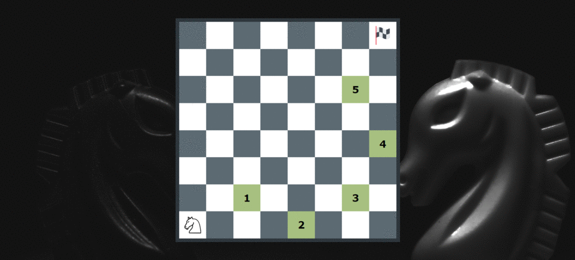

# knight-travails
One of more dreaded project from the curriculum of The Odin Project.
Knight travails is a path searching algorithm for a knight on a chess board. 
While displaying each step that knight will take in its path to reach the goal.

# How to use
Move knight or the finish flag to the field in order to display steps that knight will take to reach the flag.

[Live Demo](https://nikolamilinkovic.github.io/knight-travails/) ✨

## Features
- Path finding algorithm for knight on a chessboard
- Drag and drop UI for moving the knight and goal flag

**🧭 Possible Future Implementations**
- Add other chess figures

## 💻 Built With

